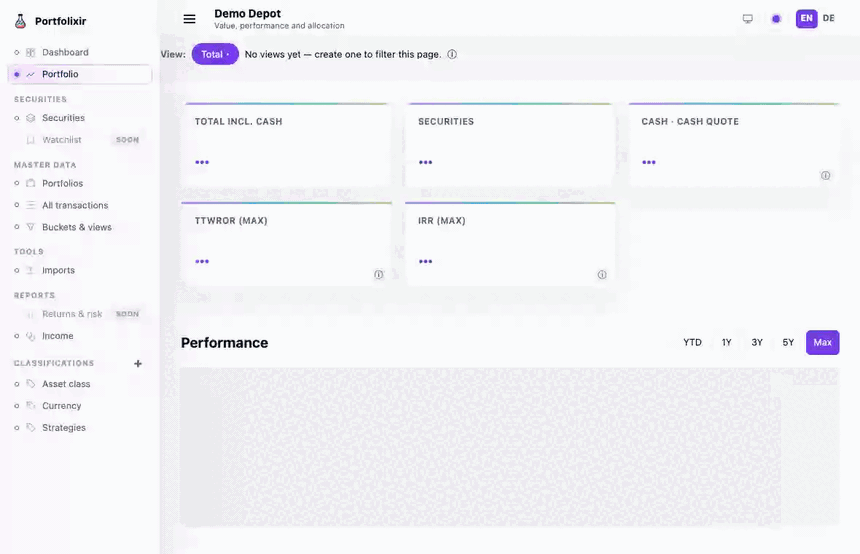
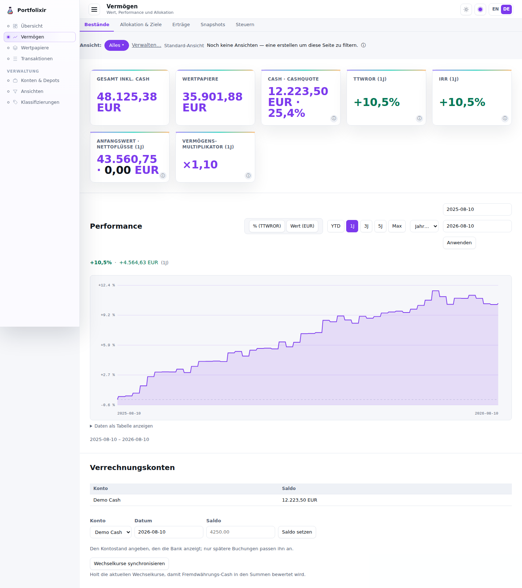
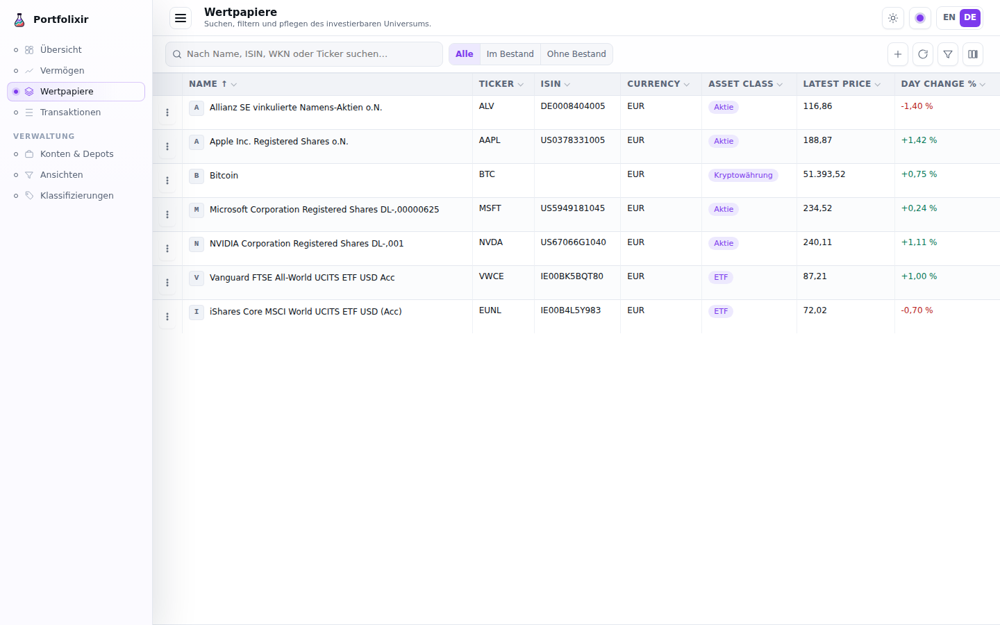

# Portfolixir

<p align="center">
  <picture>
    <source media="(prefers-color-scheme: dark)" srcset="priv/static/images/logo-dark.svg">
    <source media="(prefers-color-scheme: light)" srcset="priv/static/images/logo-light.svg">
    
  </picture>
</p>

[](https://github.com/peshay/portfolixir/actions/workflows/ci.yml)
[](https://codecov.io/gh/peshay/portfolixir)
[](https://elixir-lang.org/)
[](LICENSE)
[](https://bmad-method.org)

[](https://bunq.me/ahuservices?description=portfolixir-maintenance-support)

## What is Portfolixir

Portfolixir is a self-hosted Elixir/Phoenix portfolio system with two
first-class users: the person who owns the portfolio, and the LLM agent they
run. Everything it knows is reachable through a local JSON API and an MCP
companion, and everything it knows is also visible on a screen. One dataset,
one instance, one operator — your holdings, your agent, your machine. No cloud,
no tenancy, no broker.

It exists because portfolio facts that live *next to* a system rot. Target
weights kept in three places, a note keyed to a taxonomy that died a month ago,
a date that exists only in the text of a scheduled prompt — a stale fact and a
current one look identical there, and only a contradiction downstream reveals
which was which. Portfolixir gives every such fact a home with an identity, a
source, and an age.

Concretely, it is the place to answer questions like these:

- *Which categories drifted away from their targets, and what would it take to
  correct them?* — the target/actual breakdown with per-category drift and an
  indicative corrective quantity, computed once on the server instead of
  reassembled by hand.
- *How did this position actually do, and what did it cost?* — moving-average
  cost basis, unrealized P&L, and a price chart from local quote history.
- *What did my agent base that on?* — the same figures the agent read over MCP,
  each stating the age of its inputs, on a page a person can look at.

The project focuses on transparent portfolio records and read-only inspection.
It is not a broker, bank, trading, payment, order, or rebalance platform, and
it never calls an LLM itself: agents call Portfolixir, not the other way round.
Supported functions are also available through a local JSON API and an MCP
companion that wraps that API.

## See it in action

A quick tour of the portfolio view — switching the accent colour (violet, teal,
coral), flipping to dark mode, and a custom strategy classification showing the
target-vs-actual allocation with per-category drift for rebalancing:



| Portfolio & allocation | Securities |
| --- | --- |
|  |  |

_All screenshots use the synthetic demo dataset in
[`priv/demo/`](priv/demo/) — no real financial data._

## What works today

- Create securities, one portfolio, and linked cash/depot accounts.
- Record manual buy and sell transactions.
- Review derived holdings, cash balances, and stored quote history.
- See each holding's moving-average cost basis and unrealized P&L.
- Organise securities into classification trees (custom, plus built-in
  asset-class and currency trees); the asset-class tree is an editable taxonomy
  seeded from an inferred default and corrected by dragging.
- Set per-category target weights and read a target/actual allocation breakdown with
  per-category drift.
- Value multi-currency portfolios by converting through stored exchange rates.
- Import a Portfolio Performance CSV or JSON export: drag in the file, preview
  the records, then apply them atomically.
- Open a security detail chart from local quote history.
- Use `/api/v1` and the MCP companion for the same supported local actions,
  including update/delete and live portfolio valuation with cash.

## Quick start

### Prerequisites

- Elixir and Erlang compatible with [mix.exs](mix.exs)
- PostgreSQL
- optional: Docker and Docker Compose

### Run with Docker Compose

```sh
docker compose up --build
```

Open the app and MCP companion at:

```text
http://localhost:4000
http://127.0.0.1:4001/mcp
```

Stop and remove local volumes:

```sh
docker compose down -v
```

### Run from source

```sh
mix deps.get
mix ecto.setup
mix phx.server
```

Open the Phoenix URL printed by the server, usually
`http://localhost:4000`.

### API and MCP

Set a local API token before using `/api/v1`:

```sh
export PORTFOLIXIR_API_TOKEN=replace-me
```

Run the MCP companion separately when you do not use Docker Compose:

```sh
npm install --prefix mcp-server
npm run build --prefix mcp-server
PORTFOLIXIR_API_BASE_URL=http://127.0.0.1:4000 \
PORTFOLIXIR_API_TOKEN=replace-me \
npm start --prefix mcp-server
```

## Development

Common local checks:

```sh
mix format
mix test
pre-commit run --all-files
npm test --prefix mcp-server
npm run build --prefix mcp-server
```

Install pre-commit once per checkout:

```sh
pre-commit install --install-hooks
```

## Documentation

- [docs](docs/index.md)

- Product documentation
  - [Product docs home](docs/index.md)
  - [Product feature documentation](docs/product-documentation.md)
  - [Home Deployment](docs/home-deployment.md)
- Architecture documentation
  - [Architecture overview](docs/architecture.md)
  - [Architecture decisions (ADRs)](docs/decisions/index.md)
- Development documentation
  - [Story workflow](docs/development/story-workflow.md)
  - [Developer guide](docs/development/guide.md)
- [CONTRIBUTING.md](CONTRIBUTING.md)
- [AGENTS.md](AGENTS.md)

## Safety

Use synthetic data for development and tests. Do not commit real account
numbers, broker statements, wallet addresses, personal names, or private
portfolio files.

Tests must not make external network calls.

## Governance

- Contribution guide: [CONTRIBUTING.md](CONTRIBUTING.md)
- Security policy: [SECURITY.md](SECURITY.md)
- Code of conduct: [CODE_OF_CONDUCT.md](CODE_OF_CONDUCT.md)
- AI-agent guide: [AGENTS.md](AGENTS.md)
- License: [LICENSE](LICENSE)

## Support

If this app is useful to you, you can [support its ongoing maintenance via bunq](https://bunq.me/ahuservices?description=portfolixir-maintenance-support). Support is voluntary and appreciated, but does not create any entitlement to support, features, consulting, an SLA, or invoice-based work.

## License

This project is licensed under the MIT License. See [LICENSE](LICENSE).
