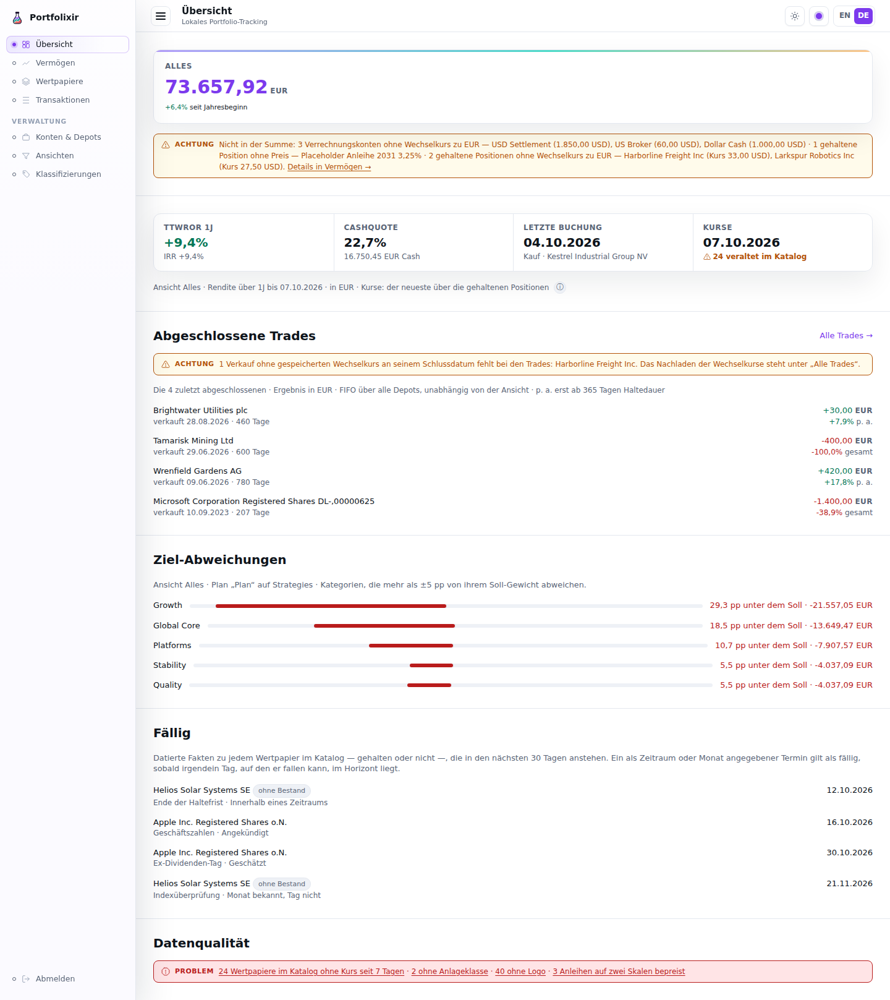
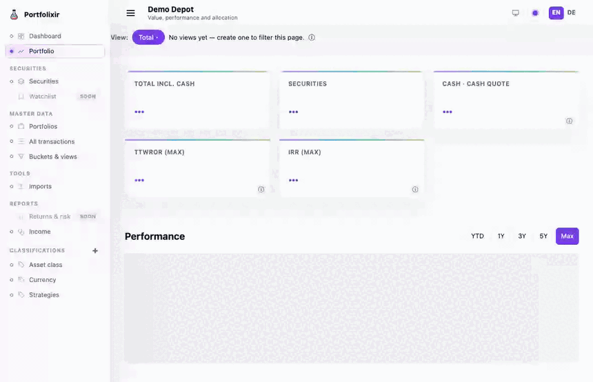
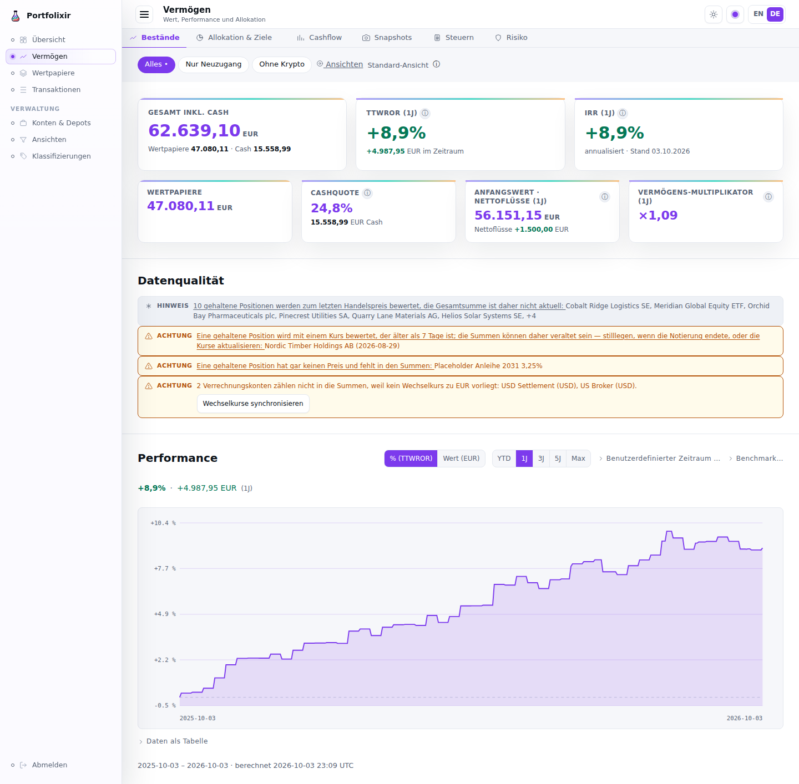
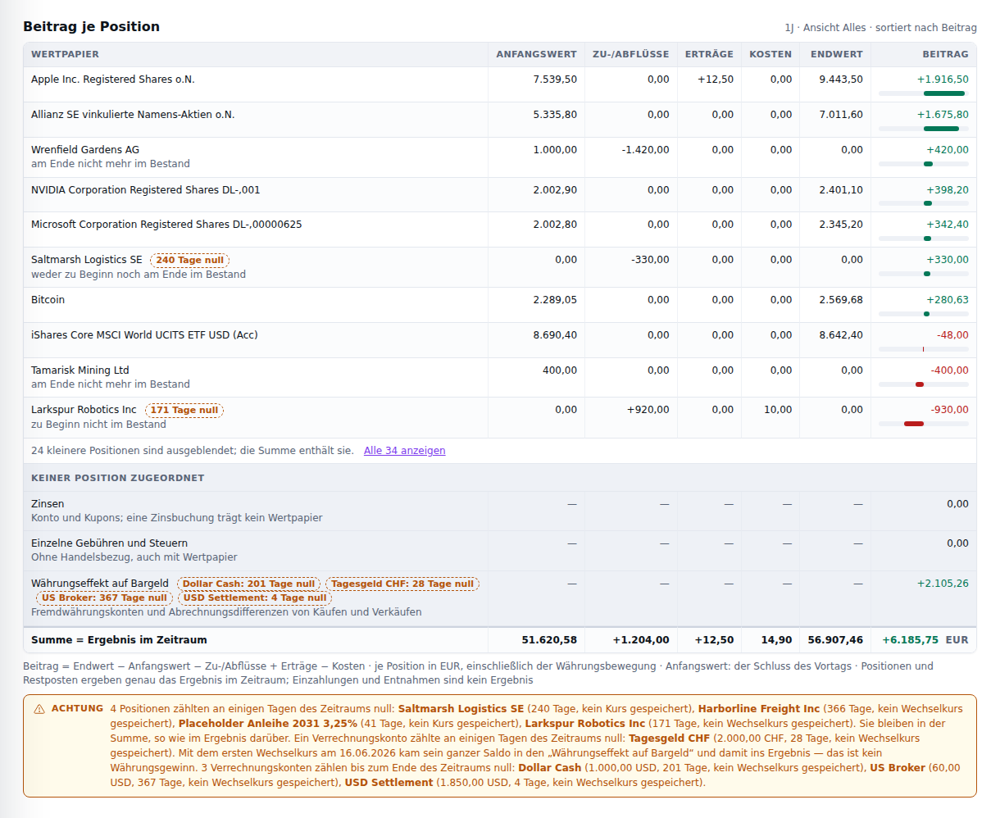
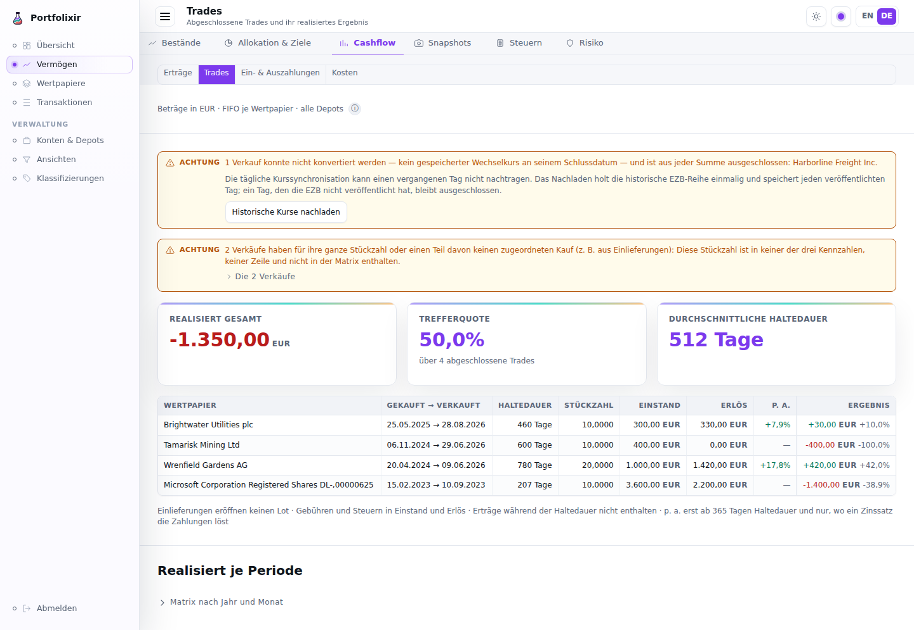
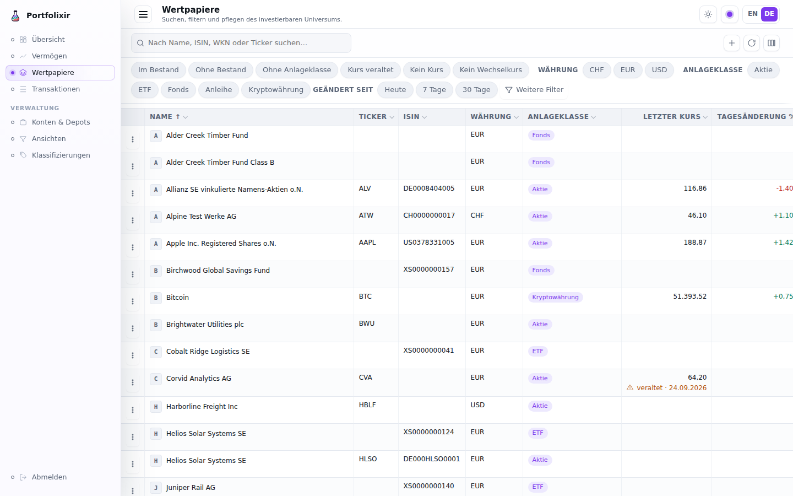

# Portfolixir

<p align="center">
  <picture>
    <source media="(prefers-color-scheme: dark)" srcset="priv/static/images/logo-dark.svg">
    <source media="(prefers-color-scheme: light)" srcset="priv/static/images/logo-light.svg">
    
  </picture>
</p>

**A self-hosted portfolio record for you and the LLM agent you run.**
Portfolixir keeps your transactions, holdings, valuation, returns and research
notes on your own machine. Everything it knows is on a screen and behind a
local JSON API and an MCP companion, so your agent reads and books the same
figures you look at. No cloud, no broker connection, no advice: it prepares
decisions, and you make them. [Features](https://portfolixir.app/features.html)
says what it does that you should know first, each claim with the page that
shows it.

## How your data gets in

- **A Portfolio Performance export.** Export your transactions from Portfolio
  Performance as CSV or JSON v1 (a CSV with the German column names the
  importer reads, `Datum;Typ;Wertpapier;…`), drop the file on the Imports page,
  read the preview and apply it. The apply is atomic, and dropping the same
  file again books nothing twice.
- **Your bank's or broker's own export, through your agent.** The MCP
  companion's `import_converter` prompt has your agent write a converter that
  runs on your machine and turns the export into a Portfolio Performance CSV
  file for the Imports page. Nothing connects to your bank, and the converter
  makes no network call.
- **By hand.** Record a transaction on the Transactions page, or have your
  agent book one at a time over the API or the MCP companion.
- **Broker PDFs: decided, not built.** Reading broker statements in the app is
  decided ([ADR-0021](docs/decisions/0021-pdf-transaction-intake.md)) but not
  built yet.

There is no bank or broker sync, by design. Agents: start at
[https://portfolixir.app/llms.txt](https://portfolixir.app/llms.txt), written
for you. Operators: [Connect an agent](docs/integration/connect-an-agent.md)
has the client configurations to copy.

[](https://github.com/peshay/portfolixir/actions/workflows/ci.yml)
[](https://codecov.io/gh/peshay/portfolixir)
[](https://elixir-lang.org/)
[](LICENSE)
[](https://bmad-method.org)

[](https://bunq.me/ahuservices?description=portfolixir-maintenance-support)

## What is Portfolixir

Portfolixir is a self-hosted Elixir/Phoenix portfolio system with two
first-class users: the person who owns the portfolio, and the LLM agent they
run. Everything it knows is reachable through a local JSON API and an MCP
companion, and everything it knows is also visible on a screen. One dataset,
one instance, one operator — your holdings, your agent, your machine. No cloud,
no tenancy, no broker.

It exists because portfolio facts that live *next to* a system rot. Target
weights kept in three places, a note keyed to a taxonomy that died a month ago,
a date that exists only in the text of a scheduled prompt — a stale fact and a
current one look identical there, and only a contradiction downstream reveals
which was which. Giving every such fact a home with an identity, a source and
an age is the goal the project is built toward; the records, classifications
and targets below are the part of it that exists today.

Concretely, it is the place to answer questions like these:

- *Which categories drifted away from their targets, and what would it take to
  correct them?* — the target/actual breakdown with per-category drift and an
  indicative corrective quantity, computed once on the server instead of
  reassembled by hand.
- *How did this position actually do, and what did it cost?* — moving-average
  cost basis, unrealized P&L, and a price chart from local quote history.
- *What did my agent base that on?* — the same figures the agent read over the
  API and MCP, on a page a person can look at, rather than a second pipeline
  that could disagree.

The project focuses on transparent portfolio records and read-only inspection.
It is not a broker, bank, trading, payment, order, or rebalance platform, and
it never calls an LLM itself: agents call Portfolixir, not the other way round.
Supported functions are also available through a local JSON API and an MCP
companion that wraps that API.

Portfolixir is written with LLM coding agents, and every commit is owned by an
accountable human under their own name (see [AGENTS.md](AGENTS.md)).

**Before you run it:** the web UI is open by default and locked by one
variable. Set `PORTFOLIXIR_UI_PASSWORD` for a Compose install: the Compose port
mapping keeps the instance on the host's loopback, but every process on that
host and the stack's other containers reach the web UI. The instance refuses
requests under a foreign `Host` and expects your own reverse proxy in front of
it for anything beyond this machine. There is no upgrade guarantee and no
claim of production readiness. See [home deployment](docs/home-deployment.md)
for what that means in practice.

## What works today

- Create securities, one portfolio, and linked cash/depot accounts.
- Group depots, accounts and positions with buckets and read every figure
  under a bucket view — the household or strategy scope of your choice.
- Record manual buy and sell transactions.
- Book the other Portfolio Performance transaction kinds (dividends, interest,
  deposits, removals, fees, taxes, transfers, deliveries) and stock splits as
  ledger events.
- Review derived holdings, cash balances, and stored quote history.
- See each holding's moving-average cost basis and unrealized P&L, split into
  the price effect and the currency effect.
- Read the holdings performance summary — true time-weighted return, IRR,
  invested capital and wealth multiple — per portfolio and per bucket view,
  with the computation basis stated next to the figure.
- Organise securities into classification trees (custom, plus built-in
  asset-class and currency trees); the asset-class tree is an editable taxonomy
  seeded from an inferred default and corrected by dragging.
- Set per-category and per-position target weights in versioned plans, and
  read a target/actual allocation breakdown with per-category drift and
  display-only rebalancing hints.
- Freeze a snapshot of the current holdings and later compare against it:
  would keeping exactly those holdings have done better?
- Record the tax block of a broker statement (loss pots, allowance) and read
  the tax-free trim budget off it — recorded, never derived.
- Keep a research log per security: dated, sourced entries that are never
  edited or removed, with the current thesis state derived from them and a
  retraction as the way to be wrong on the record.
- Value multi-currency portfolios by converting through stored exchange rates,
  including a one-shot backfill of the historical ECB series for past booking
  dates.
- Import a Portfolio Performance CSV or JSON export: drag in the file, preview
  the records, then apply them atomically; re-applying the same export is a
  no-op that preserves everything maintained in the app.
- Open a security detail chart from local quote history.
- Read the Cash-flow area's four facets — income (dividends and interest),
  realized gains from closed sales, deposits and withdrawals, and costs (fees
  and taxes) — each stating on the page what it counts, what it excludes, and
  the exchange-rate basis behind every converted figure.
- Ask "what changed since I last looked?": the transactions and securities
  lists take a `?since=` cut with one-tap windows, mirroring the API's delta
  reads, and say plainly that deletions are not represented.
- Narrow the securities list with one-tap filter chips (unclassified, stale
  quote, missing rate, and more — the same predicates the dashboard counts),
  and pick the columns the transaction history and holdings tables show.
- Use `/api/v1` and the MCP companion for the same supported local actions,
  including update/delete, live portfolio valuation with cash, and a
  contract-version read that says what the surface offers and when it last
  changed.
- Connect an MCP agent under a tool profile (`read`, `book` or `full`, so an
  agent can book without being able to delete or merge), with two prompts:
  `first_setup` and `import_converter`.

## See it in action

The Overview, the start page: the total value, the key figures, the most
recently closed trades with their result and return, the categories off
target, what falls due, and what needs attention in the data:



A quick tour of the portfolio view — switching the accent colour (violet, teal,
coral), flipping to dark mode, and a custom strategy classification showing the
target-vs-actual allocation with per-category drift for rebalancing:



| Wealth: valuation and performance | Contribution by position |
| --- | --- |
|  |  |
| **Closed trades** | **Securities** |
|  |  |

_All screenshots use the synthetic demo dataset in
[`priv/demo/`](priv/demo/) — no real financial data — and show the German
interface; [`priv/demo/screenshots.mjs`](priv/demo/screenshots.mjs)
regenerates them._

## Quick start

### Prerequisites

- For Docker Compose: Docker Engine 28.3.3 or newer, with Docker Compose. On
  an older engine the loopback-only port mappings do not keep the instance on
  your machine; the home deployment guide's
  [prerequisites](docs/home-deployment.md#prerequisites) say why.
- From source: Elixir and Erlang compatible with [mix.exs](mix.exs), and
  PostgreSQL.
- For the MCP companion run on its own: Node 24.

The first build pulls the pinned base images and downloads Debian packages, Hex
packages from hex.pm and npm packages from the npm registry. Behind a proxy, pass
it into the build with Docker's predefined proxy build arguments (`HTTP_PROXY`,
`HTTPS_PROXY`, `NO_PROXY`; for example
`docker compose build --build-arg HTTPS_PROXY=http://proxy.example:3128`) or the
Docker client's proxy configuration; behind a proxy that intercepts TLS, pass
its CA to the build as the build secret `build_ca`
([Home Deployment](docs/home-deployment.md#prerequisites) shows how).

### Run with Docker Compose

Create `.env` from `.env.example`, readable by you only
(`install -m 600 .env.example .env`), and set the secrets:
`PORTFOLIXIR_API_TOKEN`, `PORTFOLIXIR_MCP_TOKEN` and `SECRET_KEY_BASE` each from
`openssl rand -base64 48`, `POSTGRES_PASSWORD` from `openssl rand -hex 32`.
Then:

```sh
docker compose up --build
```

Open the app and MCP companion at:

```text
http://127.0.0.1:4000
http://127.0.0.1:4001/mcp
```

The development stack (source mounted, Mix present) is
`docker compose -f docker-compose.dev.yml up --build`.

Stop the instance with `docker compose down`; its data stays in its volumes.
`docker compose down -v` deletes them: the database volume
`portfolixir-postgres-data` with every record, and the logo volume
`portfolixir-logos`. Back both up first, while the instance runs, into
`~/portfolixir-backups` outside the checkout
([Backup and restore](docs/home-deployment.md#backup-and-restore) restores
them):

```sh
umask 077
mkdir -p ~/portfolixir-backups
docker compose exec -T db \
  pg_dump -U portfolixir -d portfolixir_prod --format=custom \
  > ~/portfolixir-backups/portfolixir-$(date +%F).dump
docker compose exec -T app tar -C /var/lib/portfolixir/logos -cf - . \
  > ~/portfolixir-backups/portfolixir-logos-$(date +%F).tar
docker compose exec -T db \
  pg_restore --list < ~/portfolixir-backups/portfolixir-$(date +%F).dump \
  > /dev/null && echo "backup reads"
```

Only after it printed `backup reads`, delete:

```sh
docker compose down -v
```

### Run from source

```sh
mix deps.get
mix ecto.setup
mix phx.server
```

Open the Phoenix URL printed by the server, usually
`http://localhost:4000`.

### API and MCP

`/api/v1` and the MCP companion share one bearer token. From source, export it
in the shell you start the server from, before `mix phx.server`, and keep the
value for the companion:

```sh
export PORTFOLIXIR_API_TOKEN="$(openssl rand -base64 48)"
```

Run the MCP companion separately when you do not use Docker Compose.
`npm ci` installs exactly the versions in `package-lock.json`, and
`--ignore-scripts` keeps every dependency's install-time script from running,
as CI's install does. It speaks MCP over stdin and stdout, so an MCP client
usually starts it itself (see "Connect your agent" below):

```sh
npm ci --ignore-scripts --prefix mcp-server
npm run build --prefix mcp-server
PORTFOLIXIR_API_BASE_URL=http://127.0.0.1:4000 \
PORTFOLIXIR_API_TOKEN="<the same token>" \
npm start --prefix mcp-server
```

### Connect your agent

[Connect an agent](docs/integration/connect-an-agent.md) has the MCP client
configurations to copy, for stdio and for the Compose stack's HTTP companion,
and the companion's variables. Pick a profile with `PORTFOLIXIR_MCP_PROFILE`:
`read`, `book` or `full` (the default); a profile narrows the companion, not
the API token. For the Compose stack's companion, put
`PORTFOLIXIR_MCP_PROFILE=book` in `.env` and recreate the service with
`docker compose up -d mcp`. Then ask the agent to run the `first_setup`
prompt.

## Development

Common local checks:

```sh
mix format
mix test
pre-commit run --all-files
npm test --prefix mcp-server
npm run build --prefix mcp-server
```

Install pre-commit once per checkout:

```sh
pre-commit install --install-hooks
```

## Documentation

- [docs](docs/index.md)

- Product documentation
  - [Product docs home](docs/index.md)
  - [Features](docs/features.md): what it does that you should know first, and
    what it is not
  - [Product feature documentation](docs/product-documentation.md)
  - [Home Deployment](docs/home-deployment.md)
- Integration documentation
  - [API and MCP](docs/integration/api-and-mcp.md)
  - [Connect an agent](docs/integration/connect-an-agent.md)
  - [llms.txt](docs/llms.txt), the entry written for agents
- Architecture documentation
  - [Architecture overview](docs/architecture.md)
  - [Architecture decisions (ADRs)](docs/decisions/index.md)
- Development documentation
  - [Story workflow](docs/development/story-workflow.md)
  - [Developer guide](docs/development/guide.md)
- [CONTRIBUTING.md](CONTRIBUTING.md)
- [AGENTS.md](AGENTS.md)

## Safety

Use synthetic data for development and tests. Do not commit real account
numbers, broker statements, wallet addresses, personal names, or private
portfolio files.

Tests must not make external network calls.

## Governance

- Contribution guide: [CONTRIBUTING.md](CONTRIBUTING.md)
- Security policy: [SECURITY.md](SECURITY.md)
- Code of conduct: [CODE_OF_CONDUCT.md](CODE_OF_CONDUCT.md)
- AI-agent guide: [AGENTS.md](AGENTS.md)
- License: [LICENSE](LICENSE)

## Support

If this app is useful to you, you can [support its ongoing maintenance via bunq](https://bunq.me/ahuservices?description=portfolixir-maintenance-support). Support is voluntary and appreciated, but does not create any entitlement to support, features, consulting, an SLA, or invoice-based work.

## License

This project is licensed under the MIT License. See [LICENSE](LICENSE).
