<link rel="stylesheet" href="styles.css">

<main class="docs-shell">
  <header class="docs-hero">
    
    

      
Portfolixir

      <h1>Local portfolio tracking</h1>
      

        Portfolixir is a self-hosted Phoenix and LiveView application for
        transparent local portfolio records, manual transactions, holdings, and
        quote history.
      

    

  </header>

  <section class="docs-panel">
    <h2>Current Scope</h2>
    

      The app focuses on a small local workflow for securities, one portfolio,
      linked cash and depot accounts, manual buy/sell transactions, holdings,
      stored quotes, and security price history.
    

    <ul>
      <li>Responsive Phoenix and LiveView app shell with matching docs styling.</li>
      <li>Light and dark themes using the Portfolixir logo palette.</li>
      <li>Top-bar controls for theme and English/German language switching.</li>
      <li>Manual securities, accounts, transactions, holdings, and quote history.</li>
    </ul>
  </section>

  <section class="docs-grid">
    <article class="docs-card">
      <h2>Local Workflow</h2>
      <ol>
        <li>Create securities.</li>
        <li>Create one portfolio.</li>
        <li>Link one depot to one cash account.</li>
        <li>Record manual buy and sell transactions.</li>
        <li>Review current holdings.</li>
        <li>Store and display quote history.</li>
      </ol>
    </article>

    <article class="docs-card">
      <h2>Theme and Language</h2>
      

        The app and documentation share the same violet, teal, and coral accent
        palette. The app starts with the system theme and browser language, and
        the top bar lets you switch System, Light, and Dark themes as well as
        English and German UI text.
      

    </article>

    <article class="docs-card">
      <h2>Development</h2>
      

        Start locally with Docker Compose or run the Phoenix app from source.
        Keep changes scoped, tested, and documented when visible behavior
        changes.
      

      

        Portfolixir is not a broker, bank, trading, payment, order, or rebalance
        platform.
      

    </article>
  </section>

  <footer class="docs-footer">
    <a href="home-deployment.md">Home Deployment</a>
  </footer>
</main>
